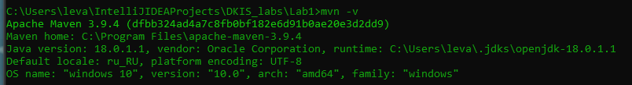

# Практическая работа №1

#### Вариант 19: Мебель, стул, стол, шкаф

## Сборка и запуск

Необходим Maven и 18 версия JDK:

#### Дальнейшие действия производим в папке проекта <br>
Компиляция:
```
mvn compile
```
Смена кодировки консоли для поддержки русских букв:
```
chcp 65001
```
Запуск программы
```
mvn exec:java
```