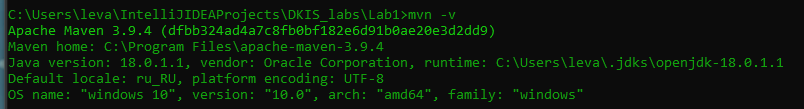

# Практическая работа №2
## Сборка и запуск
Необходим Maven и 18 (или 17) версия JDK:

#### Дальнейшие действия производим в папке проекта <br>
Компиляция (не обязательно):
```
mvn compile
```
## ___Программа уже скомпилирована___
# Запуск программы
```
mvn exec:java
```
### Вариант 19: Микросхема
Необходимые пункты:
1. Реализовать внедрение простых значений через конструктор
2. Реализовать внедрение зависимости по ссылке через конструктор
3. Интерфейс должен содержать как минимум один метод
4. Классы, имплементирующие интерфейс, должны содержать как минимум одно поле (у разных классов - разные)
5. Зависимый класс должен содержать метод, который на основе вызова метода у зависимости выводил бы некоторое сообщение в консоль (Например для класса Автомобиля, в который внедряются Двигатели. Они могут выдавать свою мощность, а автомобиль может выводить сообщение, с какой скоростью он может двигаться).
6. Реализовать внедрение простых значений из внешнего файла через setter


Был создан интерфейс для имплементации:
``` java
public interface Component {
  void process();
}
```
<div style="text-align: right;"><em>Пункт 3 выполнен</em></div>

Класы имплементирующие его:
```java
public class Memory implements Component{
  private final int size;

  public Memory(int size) {
    this.size = size;
  }

  @Override
  public void process() {
    System.out.println("Storing " + size + "GB of data by RAM.");
  }
}

public class Processor implements Component {
  private final String model;


  public Processor(String model) {
    this.model = model;
  }

  @Override
  public void process() {
    System.out.println("Processing data by " + model);
  }
}
```
<div style="text-align: right;"><em>Пункт 4 выполнен</em></div>

И зависимый класс микросхемы:
```java
public class Microchip {

  private final Component component;
  private final String model;

  private int id;

  @ConstructorProperties({"component", "model"})
  public Microchip(Component component, String model) {
    this.component = component;
    this.model = model;
  }

  public void setId(int id) {
    this.id = id;
  }

  public void run() {
    System.out.println("This " + model + " " + id + " microchip can:");
    component.process();
  }

}
```
<div style="text-align: right;"><em>Пункт 5 выполнен</em></div>

Были созданы бины для классов - зависимостей:
```xml
  <bean id="memoryBean"
    class="ru.paskal.Lab2.Dependences.Memory">
    <constructor-arg value="${memory.size}"/>
  </bean>

  <bean id="cpuBean"
    class="ru.paskal.Lab2.Dependences.Processor">
    <constructor-arg value="${cpu.modelName}"/>
  </bean>
```
<div style="text-align: right;"><em>Пункт 1 выполнен</em></div>

И бины для зависимого класса:
```xml
  <bean id="cpuMicrochip"
    class="ru.paskal.Lab2.Microchip">
    <constructor-arg name="component" ref="cpuBean"/>
    <constructor-arg name="model" value="${cpuMicrochip.modelName}"/>
    <property name="id" value="${cpuMicrochip.id}"/>
  </bean>

  <bean id="ramMicrochip"
    class="ru.paskal.Lab2.Microchip">
    <constructor-arg name="component" ref="memoryBean"/>
    <constructor-arg name="model" value="${ramMicrochip.modelName}"/>
    <property name="id" value="${ramMicrochip.id}"/>
  </bean>
```
<div style="text-align: right;"><em>Пункты 2, 6 выполнены</em></div>

