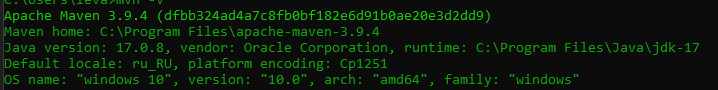

# Практическая работа №3
## Сборка и запуск
Необходим Maven и 17 версия JDK:

### Установка
1. Открываем любую понравившуюся папку
2. Запускаем консоль git в этой папке
3. Вставляем туда:
```
git clone https://github.com/OverLeo007/DKIS_Lab3
cd DKIS_Lab3
mvn package
java -jar target/Lab3.jar 
```
### Или по порядку
1. Загрузка:
```
git clone https://github.com/OverLeo007/DKIS_Lab3
```
2. Смена директории:
```
cd DKIS_Lab3
```
3. Сборка:
```
mvn package
```
3. Запуск программы
```
 java -jar target/Lab3.jar 
```
### Вариант 19: Микросхема
Необходимо создать приложение, в котором будут объявлены 
Spring-конфигурации при помощи аннотаций и класса-конфигурации. 
Снабдить спроектированные классы init- и destroy-методами, 
а также использовать фабричный метод для любого из классов.
Необходимые пункты:
1. Реализовать внедрение простых значений через конструктор
2. Реализовать внедрение зависимости по ссылке через конструктор
3. Интерфейс должен содержать как минимум один метод
4. Классы, имплементирующие интерфейс, должны содержать как минимум одно поле 
(у разных классов - разные)
5. Зависимый класс должен содержать метод, который на основе вызова метода у 
зависимости выводил бы некоторое сообщение в консоль (Например для класса Автомобиля, 
в который внедряются Двигатели. Они могут выдавать свою мощность, а автомобиль 
может выводить сообщение, с какой скоростью он может двигаться).
6. Реализовать внедрение простых значений из внешнего файла через setter
