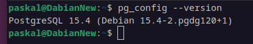

# Практическая работа №5
## Сборка и запуск
Необходим Maven и 17 версия JDK:

А также PostgreSQL 15 версии:\

### Установка
1. Открываем любую понравившуюся папку
2. Запускаем консоль git в этой папке
3. Вставляем туда:
```
git clone https://github.com/OverLeo007/DKIS_Lab5
cd DKIS_Lab5
psql -U postgres -h localhost -f create_db.sql
sh mvnw package
java -jar target/Lab5-0.0.1-SNAPSHOT.jar
```
4. Открываем в браузере страницу: ``http://localhost:8080``
```
xdg-open http://localhost:8080
```
### Или по порядку
1. Загрузка:
```
git clone https://github.com/OverLeo007/DKIS_Lab5
```
2. Смена директории:
```
cd DKIS_Lab5
```
3. Создание базы данных:
```
psql -U postgres -h localhost -f create_db.sql
```
4. Сборка:
```
sh mvnw package
```
3. Запуск программы
```
java -jar target/Lab5-0.0.1-SNAPSHOT.jar
```
4. Запуск web страницы
```
xdg-open http://localhost:8080
```

### Вариант 19: Музыкальный инструмент
Необходимо:
Web-приложение должно иметь следующие страницы:

 * Главная страница содержит приветствие и ссылки на другие, которые дублируют по функционалу пункты меню из работы №4.
 * Страница просмотра таблицы записей.
 * Страница добавления новой записи в таблицу.
 * Страница редактирования записи.
 * Страница удаления записи.
 * Страница просмотра записей согласно некоторому критерию (аналогично пункту из практической работы №4).