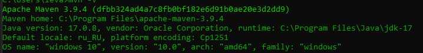
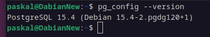

# Практическая работа №6
## Сборка и запуск
Необходим Maven и 17 версия JDK:\
\
А также PostgreSQL 15 версии:\

### Установка
1. Загрузка:
```
git clone https://github.com/OverLeo007/DKIS_Lab5
```
2. Смена директории:
```
cd DKIS_Lab6
```
3. Создание базы данных:
```
psql -U postgres -h localhost -f create_db.sql
```
4. Сборка:
```
sh mvnw package
```
3. Запуск программы
```
java -jar target/Lab6-0.0.1-SNAPSHOT.jar
```
4. Запуск web страницы
```
xdg-open http://localhost:8080
```
5. В виду шифрования паролей, пользователя admin необходимо создать вручную, 
пользователю с `username = admin` роль администратора будет присвоена автоматически, 
любые другие пользователи будут созданы с ролью USER [**Реализация**](https://github.com/OverLeo007/DKIS_Lab6/blob/master/src/main/java/ru/paskal/Lab6/services/ShopUserService.java#L51-L53)


### Вариант 19: Музыкальный инструмент
Необходимо:
Web-приложение должно иметь следующие страницы:

 * Добавлена простейшая страница регистрации. Пользователь вводит свои логин и пароль и данная информация вносится в базу данных, пользователю присваивается роль пользователя (User) приложения.
 * Добавлена простейшая форма аутентификации. Форма создается программно, а не автоматически генерируется Spring.
 * В приложении предусмотрен пользователь — администратор (Admin) с ролью отличной, от User.
 * Были разграничены уровни доступа к страницам приложения. Пользователь (User) имеет доступ только к страницам просмотра всех записей и запросов. Администратор (Admin) имеет возможность добавлять, редактировать и удалять записи.
 * Информация о пользователях и их ролях храниться в базе данных. Роли хранятся в столбце таблицы User, пароли шифруются при помощи BCrypt
 * Предусмотрена возможность выхода из приложения (logout).
 * Реализовано отображения роли пользователя после его входа.
