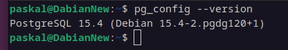
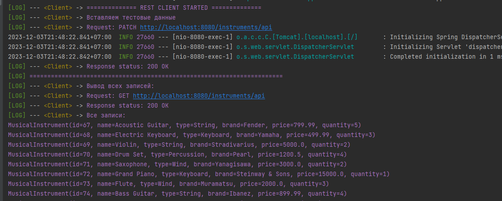
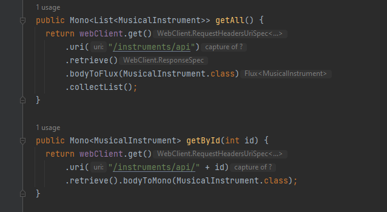

# Практическая работа №7
## Сборка и запуск
Необходим Maven и 17 версия JDK:\
\
А также PostgreSQL 15 версии:\

### Установка
1. Загрузка:
```
git clone https://github.com/OverLeo007/DKIS_Lab7
```
2. Смена директории:
```
cd DKIS_Lab7
```
3. Создание базы данных:
```
psql -U postgres -h localhost -f create_db.sql
```
4. Сборка:
```
sh mvnw package -Dallow.run=false 
```
(для предотвращения запуска клиента)
3. Запуск программы
```
java -jar target/Lab7-0.0.1-SNAPSHOT.jar -Dallow.run=true
```
Тестовые запросы будут совершены и выведены по завершенни загрузки сервера, 
после этого можно совершать любые запросы а также пользоваться MVC версией приложения\
\
_Внешний вид демонстрационного примера_\
Документация запросов сгенерирована при помощи Postman: [https://documenter.getpostman.com/view/30539611/2s9YeK4qP2](https://documenter.getpostman.com/view/30539611/2s9YeK4qP2)
### Вариант 19: Музыкальный инструмент
Было принято решение запускать демонстрационный пример работы сразу при запуске сервера, 
для упрощения установки.
Клиентская часть приложения была реализована при помощи Spring Boot WebClient\
\
_Внешний вид запросов к серверу_
