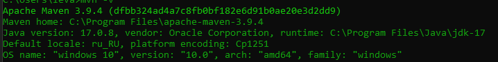

# Практическая работа №8
## Сборка и запуск
Необходим Maven и 17 версия JDK:\

ActiveMQ версии 6.0.1\

А также PostgreSQL 15 версии:\

### Установка
1. Загрузка:
```
git clone https://github.com/OverLeo007/DKIS_Lab8
```
2. Смена директории:
```
cd DKIS_Lab8
```
3. Создание базы данных:
```
psql -U postgres -h localhost -f create_db.sql
```
4. Запуск ActiveMQ
```
activemq start
```
5. Сборка:
```
sh mvnw package -Dallow.run=false 
```
(для предотвращения запуска клиента)
6. Запуск программы
```
java -jar target/Lab8-0.0.1-SNAPSHOT.jar -Dallow.run=true
```
7. Открываем в браузере страницу: ``http://localhost:8080``
```
xdg-open http://localhost:8080
```
### Вариант 19: Музыкальный инструмент
Отправка сообщений и возможность покупки были реализованы только в web (не REST) формате приложения,
однако REST функционал, реализованый в прошлой работе поддерживается.\
Сообщения отправляются из контроллера и принимаются отдельным потоком, 
который проверяет очередь каждые 200 мс.
При наличии сообщения он тут же его выводит в терминал. \

_Пример вывода сообщений в консоль_\
Завершается поток при остановке сервера (реализовано при помощи @PreDestroy).\
    Механика с удалением из БД при покупке заменена на механику изменения значения Quantity у объекта,
при отображение всех объектов, объекты с нулевым параметром этого значения не выводятся, 
также кнопка покупки на странице такого объекта будет выключена, и не приведет к покупке.


